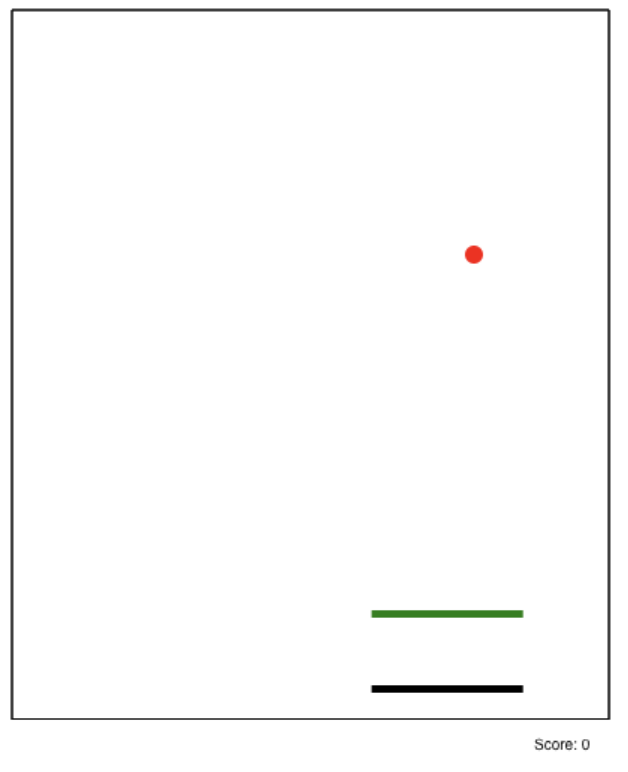

# Snake Multiplayer Game

## Setup

To run frontend:

`cd frontend`

`./gradlew run`

To run backend:

`cd backend`

`./gradlew run`

## Frontend Design 

MVC Pattern is employed on the frontend. 

#### Model
 In this game, the models all implements IDrawable, which has the method onDraw. The models in the game are:

1. Snake. The Snake class has attributes:
    - Segments which represents the body of the snake
    - Speed of how fast the snake is moving 
    - Direction to which the snake moves
    - Color of the snake

2. Map. Map comprises of Lines that when being hit by the Snake ends the game.

3. Score. Score keep tracks of the score of the game.

4. Game. The game has a scene and contains the following methods:
    - onDraw
    - onInterval
    - onWebsocket
    - onKey
    - onClick
   Each of the above methods invokes the its scene's onX method.

5. Scenes. Scene is a sealed class which has Start, WaitOpponent, Game, and End as its subclasses.
   The Start scene contains the data to be displayed when the game first starts. The WaitOpponent
   scene is in place for user who created the room to wait for opponent to join the room. The Game 
   scene contains all necessary game data. End Scene is the scene to be displayed when game is over.
   The Game object's scene is reset each time the scene changes.

##### Start Scene

##### Game Scene

##### End Scene

   

#### View

The View of this class is the Canvas which has a draw method that takes in the Game object invoke its
on draw to draw the game on screen.

#### Controller 

The controller initialize method contains logic to initialize the size of canvas. It also initializes the game
(Game) object with a Start screen. 

The controller run method does the following:
1. Sets intervals to invoke `game.onInterval()`
2. Sets intervals to invoke `canvas.draw(game)`
3. Adds listener to listen for keydown events and invoke `game.onKey()`
4. Adds listener to listen for click events and invoke `game.onClick()`
5. Adds listener to listen for new web socket messages and invoke `game.onWebsocket()`

## Backend Design

Ktor is used as the backend server framework.

 When user creates a room:

    -  the `CREATE room_id` message is fired from frontend to the backend.

    -  The backend create a map that maps the room_id to web socket hook that fires the request (i.e. this socket).

When user joins a room:

    - The `JOIN room_id` message is fired from frontend to the backend.

    - The backend finds the web socket hook mapped to room_id and create a new mapping that maps the web socket found to this socket.

    - Now connection between two clients are established.

When user makes a move in the game:

    - The `UPDATE snake <json>` message is fired from the frontend to the backend

    - Message received by the backend is then forwarded the opponent's frontend

    - The serialized json is decoded on opponent frontend and `other` is updated to the received data.

When user eats a food in the game:

    - The `UPDATE food <json>` message is fired from the frontend to the backend

    - Message received by the backend is then forwarded the opponent's frontend

    - The serialized json is decoded on opponent frontend and `food` is updated to the received data.

The frontend does not pull data every second to update opponent's snake data. Instead, it does so only
when opponents makes a move or when the food is being eaten. The frontend interpolates "snapshots" between 
each move. See [here]("https://developer.valvesoftware.com/wiki/Source_Multiplayer_Networking") for more details.
